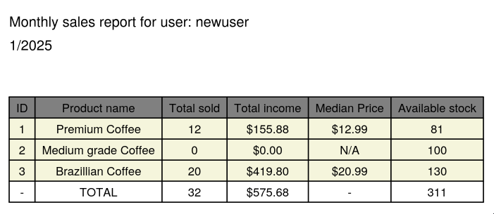

# Django API
Stock management API using django framework

## installation

```
git clone https://github.com/m1tk/django_api
cd django_api
pip install -r requirements.txt
```

## Running

A .env must be properly configured before running:
```
SECRET_KEY=VERY_SECRET_KEY_FOR_DJANGO_AUTH
DB_NAME=postgres
DB_USER=postgres
DB_PASSWORD=pass
DB_HOST=localhost
DB_PORT=5432
```

Then database can be migrated and then we can start our API service:
```
python manage.py makemigrations
python manage.py migrate
python manage.py runserver
```

## API
- `/api/signup`: Create new account

```
curl -X POST http://localhost:8000/api/signup \
     -H "Content-Type: application/json" \
     -d '{
         "username": "user",
         "password": "pass"
     }'

{"id":3,"username":"user"}
```

- `/api/login`: Authenticate to get a JWT token to exploit protected API

```
curl -X POST http://localhost:8000/api/login \
     -H "Content-Type: application/json" \
     -d '{"username": "user", "password": "pass"}'
{"access":"ACESS_TOKEN","refresh":"REFRESH_TOKEN","user":{"id":3,"username":"user"}}
```

- `/api/product/create`: Create a new product

```
curl -H "Authorization: Bearer ACCESS_TOKEN" -H "Content-Type: application/json" \
     -d '{
         "name": "Brazillian Coffee",
         "description": "High quality coffee beans",
         "quantity": 150,
         "unit_price": 20.99
     }' \
     http://localhost:8000/api/product/create

{"id":3,"name":"Brazillian Coffee","description":"High quality coffee beans","quantity":150,"unit_price":"20.99","user":1,"created_at":"2025-01-26T15:42:01.013069Z"}
```

- `/api/sale/create`: Create a new sale

```
curl -X POST http://localhost:8000/api/sale/create \
     -H "Authorization: Bearer ACCESS_TOKEN" \
     -H "Content-Type: application/json" \
     -d '{
         "product": 3,
         "quantity": 20
     }'
{"id":3,"product":3,"quantity":20,"unit_price":"20.99","date":"2025-01-26T15:44:11.985098Z"}
```

- `/api/product/status`: Get current status of product

```
curl -H "Authorization: Bearer ACCESS_TOKEN" http://localhost:8000/api/product/status | jq

[
  {
    "id": 1,
    "name": "Premium Coffee",
    "description": "Arabica whole beans",
    "quantity": 81,
    "unit_price": "12.99",
    "user": 1,
    "created_at": "2025-01-26T13:07:22.150217Z"
  },
  {
    "id": 2,
    "name": "Medium grade Coffee",
    "description": "Arabica beans",
    "quantity": 100,
    "unit_price": "6.99",
    "user": 1,
    "created_at": "2025-01-26T13:07:33.645325Z"
  },
  {
    "id": 3,
    "name": "Brazillian Coffee",
    "description": "High quality coffee beans",
    "quantity": 130,
    "unit_price": "20.99",
    "user": 1,
    "created_at": "2025-01-26T15:42:01.013069Z"
  }
]


curl -H "Authorization: Bearer ACCESS_TOKEN" http://localhost:8000/api/product/status/3 | jq
  
{
  "id": 3,
  "name": "Brazillian Coffee",
  "description": "High quality coffee beans",
  "quantity": 130,
  "unit_price": "20.99",
  "user": 1,
  "created_at": "2025-01-26T15:42:01.013069Z"
}
```

- `/api/report`: Get monthly sales report
```
curl -H "Authorization: Bearer ACCESS_TOKEN" http://10.0.2.3:8000/api/report/1/2025 -o rep.pdf
```



Mohammed Salih
